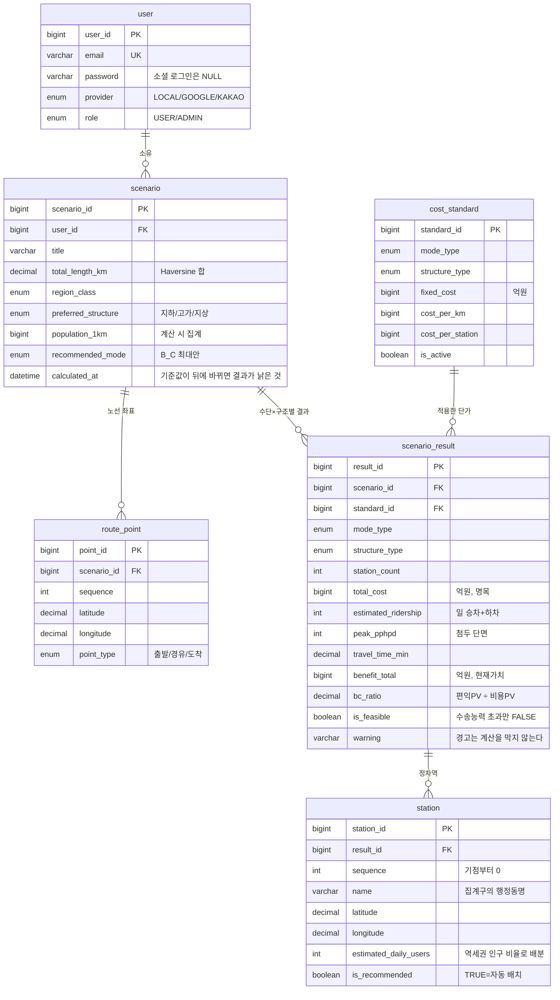
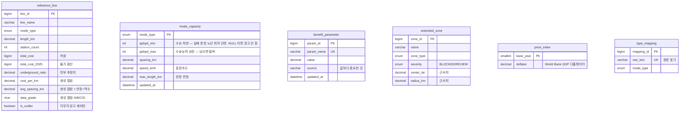

# ERD — 실제 스키마

`docs/erd.png` 은 **제안서에 낸 그림**이고, 아래가 실제로 구현된 스키마다.
둘이 다르므로 보고서를 쓸 때는 이쪽을 보고 쓸 것.

## 제안서 ERD 와 달라진 점

**제안서는 시나리오 한 행에 수단 하나를 담았다.** 그러면 이 서비스의 핵심인
"수단×구조 전부를 계산해 나란히 비교하는 표"를 저장할 수 없다. 그래서 둘로 쪼갰다.

```
제안서   scenario (노선 + 수단 + 비용 + B/C)  ← 한 행에 다 들어 있음
실제     scenario (노선만) ─1:N─ scenario_result (수단×구조별 결과) ─1:N─ station
```

`station` 이 `scenario` 가 아니라 `scenario_result` 에 매달리는 이유도 같다.
**역간격이 수단마다 달라 정차역 배치가 수단마다 다르다** (같은 11km 노선이
BRT 9역 · 경전철 10역 · 트램 13역).

## 전체



## 기준값 (서비스가 참조만 한다)

ETL·시드가 채우고 관리자만 고친다. 시나리오와 FK 로 묶이지 않는다
(`cost_standard` 만 결과에 어떤 단가를 썼는지 남기려고 연결돼 있다).



## 스키마를 바꿀 때

`db/schema/*.sql` 이 유일한 출처다 (`ddl-auto=validate` 고정 — JPA 는 만들지 않는다).
바꾸면 **엔티티·DTO·리포지토리·`etl.py` 의 `SQL_COLUMNS`·이 문서**를 함께 고치고,
`docker compose down -v` 로 볼륨을 비워야 initdb 가 다시 돈다.
